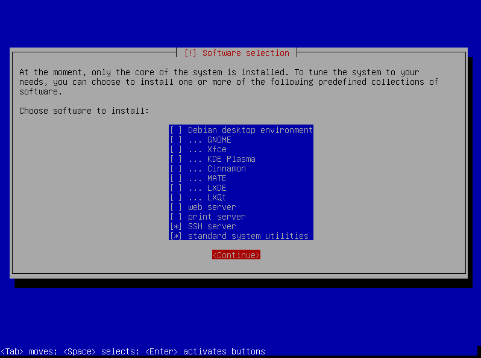
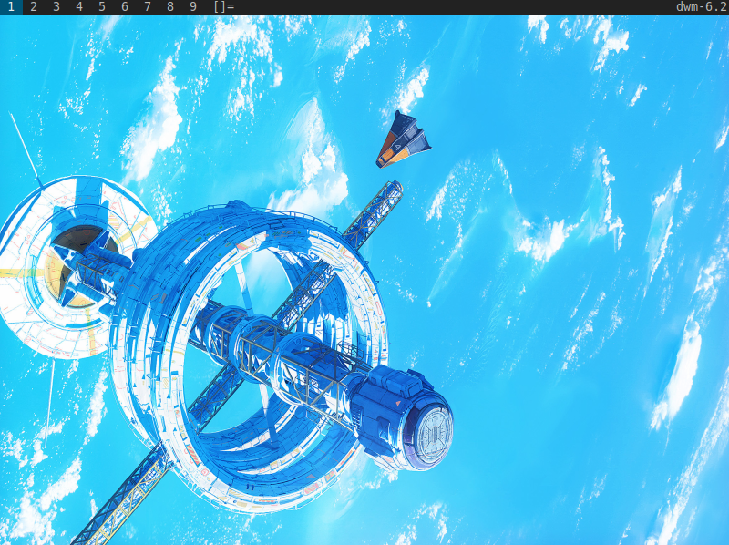

# dwm for dummies, debian edition
`debian_dwm` is a bootstrap script for a fresh minimal install of the debian operating system.

From [dwm.suckless.org](https://dwm.suckless.org/):
```text
Because dwm is customized through editing its source code, it's pointless to make binary packages of it.
This keeps its userbase small and elitist.
No novices asking stupid questions.
```
Because the suckless philosophy is not very new user friendly, I figured a script that would get people off in the right direction might be somewhat helpful.
By no means does this script prepare you for modifying or compiling your own dwm environment, it is purely meant as an bootstrapping script to help introduce it to folks curious about tiling window managers.

To get started, you'll need a fresh installation of [debian](https://www.debian.org/distrib/netinst) without a desktop environment.
In case you're unfamiliar with what that looks like, here is an example.



Please bear in mind that this script should be run from a `user account` rather than `root`.
After finalizing the installation, log into your root account and to grant your new user `sudo` privileges.

```bash
apt install sudo
usermod -aG sudo new_username
```

Reboot your machine and log into your account `new_username`.
Now you can clone this repo and run the script.

```bash
sudo apt install git
sudo git clone https://github.com/orioncrocker/debian_dwm
cd debian_dwm
./debian_dwm.sh
```

Once this is complete, type `startx` to enter the dwm environment.
Congratulations!
You've fallen for the meme and installed a tiled windows manager on your machine.
May God have mercy on your poor poor soul.
It should look something like this.



Now comes the fun part, figuring out how everything works.
I won't go into any great detail here, purely because there are plenty of other sites that have done
a far better job at explaining dwm than I ever will be able to convey in this readme.
So far the best guide I've found out there is [Dave's Visual Guide to dwm](https://ratfactor.com/dwm).

It will take some getting used to, and it might not be worth it.
Best of luck.

I honestly only use this window manager because it helps squeeze a couple extra hours out of my old Acer Aspire One laptop.
If you are in a similar situation as me and stuck with older hardware, this might be a decent window manager to try out.
Who knows, you might even grow to like it.